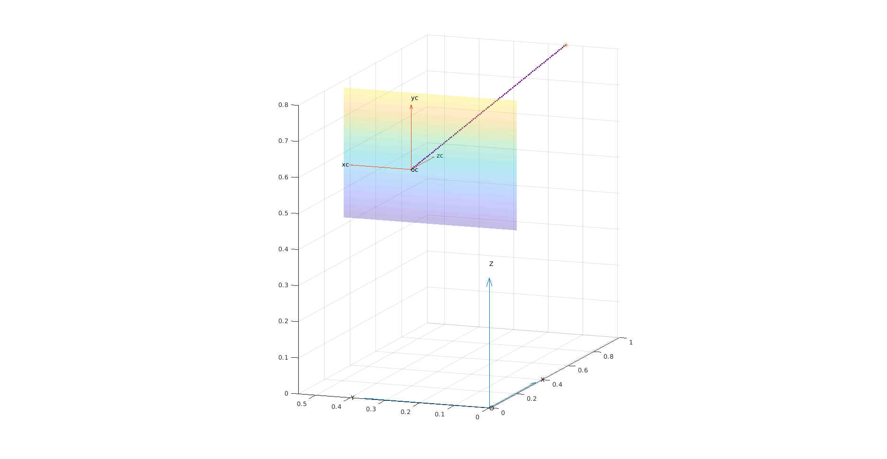
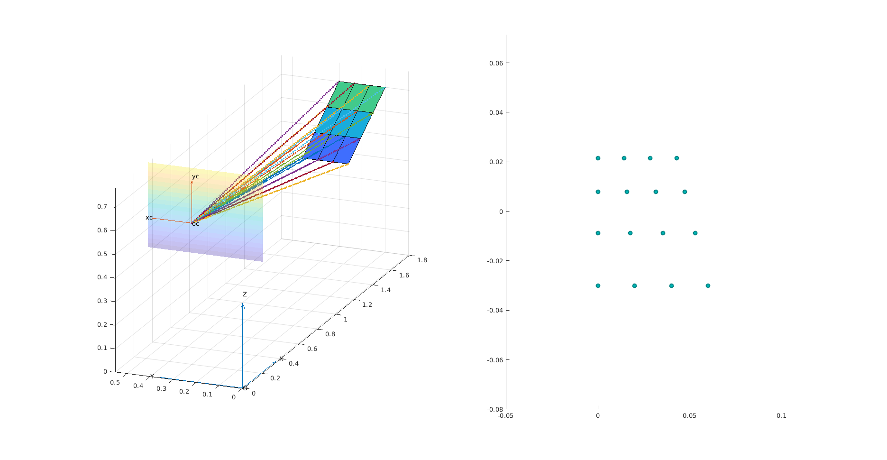

# Pinhole-Camera-Model-

This project is a simple implementation of the pinhole camera model in Matlab 2020b with the purpose of studying the single camera geometry, in particular the projection from Euclidean space in 3D to the image space in 2D. It is possible to execute the experiment both in a Matlab script and in Simulink.

The file are organized as follows:

- **sistemi_di_riferimento.m**, which is just a script to explain the reference systems that are *world frame* and *camera frame*;
- **camera.m**, which is a script that simulates a projection in the image plane for a point and for a rectangle e creates the relative plots;
- **proj.m**, which contains the function that executes the projection in the image plain;
- **rot.m**, which contains the function that executes the rototraslation from world frame to camera frame;
- **take_photo**, which is a function that returns the projection in another plot 2D (like a photograph);
- **init.m**, is the file in which the variable for the Simulink simulation are initialized;
- **camera_model.slx**, is the simulink model of the pinhole camera, which was also saved in Matlab 2019b (camera_model_2019b.slx);
- **plot_simulink.m**, which is the script for show the results of the Simulink simulation.

<h3>Matlab script</h3>
To execute the Matlab script is enough to run *camera.m*. Parameters that can be changed are:

- **O**, which is the position of the world frame;
- **C**, which is the position of the camera frame;
- **f**, focal distance of the camera, which is a fundamental parameter of the camera.

After the execution of the script will appear two plots: one for the projection of a generic point and one for the projection in the image plane of a inclined rectangle, as mentioned above.

The second plot also contains the projection in a separate chart (as a photograph).

<figure class="image">
  
  <figcaption></figcaption>
</figure>

<figure class="image">
  
  <figcaption></figcaption>
</figure>

<h3>Simulink simulation</h3>

To execute the simulation it is first necessary to run the **init.m** file in order to declare all the costants which are used in the simulation. After that it is possible the simulink file **camera_model.slx** and finally it is possible to execute **plot_simulink.m** to show the results.

Currently this section concerning simulink is still in progress.
